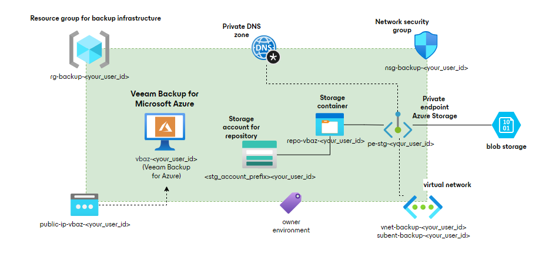

# Terraform Sample Code - Veeam Backup for Microsoft Azure

This folder contains sample code for automating deployment for Veeam Backup for Microsoft Azure (VBAZ) using Terraform.

[Terraform](https://www.terraform.io/intro) is a tool for _building_, _changing_, and _versioning_ infrastructure safely and efficiently. Terraform can manage existing and popular service providers as well as custom in-house solutions. There are both [paid and open-source](https://www.hashicorp.com/products/terraform/pricing) versions of Terraform.

## 📗 Documentation

The code deploys a dedicated resource group, networking infrastructure in the resource group, VBAZ appliance and a storage account for VBAZ backup repository. All resources are tagged with 2 tags - owner and environment. The storage account is accessed over a private endpoint connection created by the code. Private DNS zone is also created and used. 

In case you don't need the storage account, you can comment it out. VBAZ will deploy succesfully without. During VBAZ configuration you will need to provide a storage account and container to be used for backup repository.

## ✍ Contributions

We welcome contributions from the community! We encourage you to create [issues](https://github.com/VeeamHub/veeam-terraform/issues/new/choose) for bugs and feature requests and submit pull requests. For more information, refer to our [Contributing Guide](CONTRIBUTING.md).

## 🤝🏾 License

* [MIT License](LICENSE)

## 🤔 Questions

If you have any questions or something is unclear, please don't hesitate to [create an issue](https://github.com/VeeamHub/veeam-terraform/issues/new/choose) and let us know!
