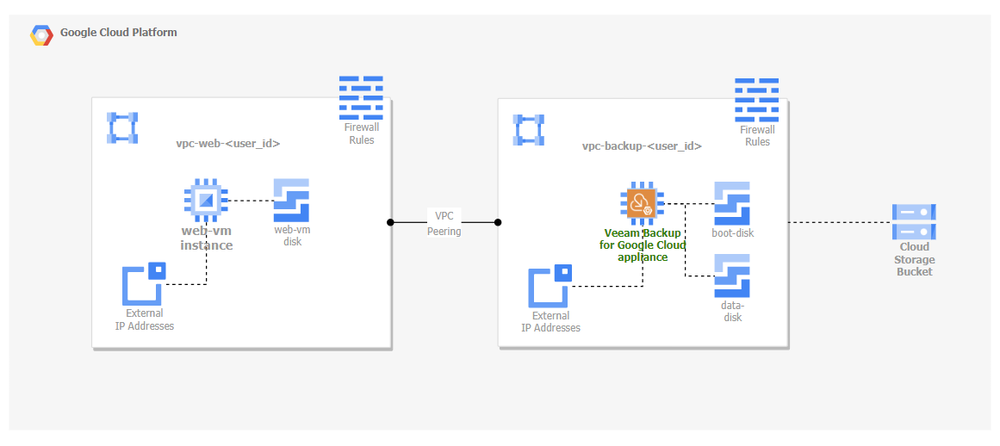

# Terraform Sample Code - Veeam Backup for Google Cloud

This folder contains sample code for automating deployment for Veeam Backup for Google Cloud (VBG) using Terraform.

[Terraform](https://www.terraform.io/intro) is a tool for _building_, _changing_, and _versioning_ infrastructure safely and efficiently. Terraform can manage existing and popular service providers as well as custom in-house solutions. There are both [paid and open-source](https://www.hashicorp.com/products/terraform/pricing) versions of Terraform.

## 📗 Documentation

The code deploys multiple isolated enviroments. Each environment is made of a Veeam Backup for Google Cloud (VBG) instance, a workload VM to protect running WordPress, 2 VPCs and a Google Cloud bucket to store image level backups.

The deployed infrastructure is customizable in the auto.tfvars file, however at a minimum a new VPC for VBG and a VBG instance with public IP will be deployed.

Code uses a signle GCP project and specific limits can be reached while deploying  multiple instance (such as number of VPCs per project).

Usage instructions and details for each sample is located within the respective folder.

## ✍ Contributions

We welcome contributions from the community! We encourage you to create [issues](https://github.com/VeeamHub/veeam-terraform/issues/new/choose) for bugs and feature requests and submit pull requests. For more information, refer to our [Contributing Guide](CONTRIBUTING.md).

## 🤝🏾 License

* [MIT License](LICENSE)

## 🤔 Questions

If you have any questions or something is unclear, please don't hesitate to [create an issue](https://github.com/VeeamHub/veeam-terraform/issues/new/choose) and let us know!
